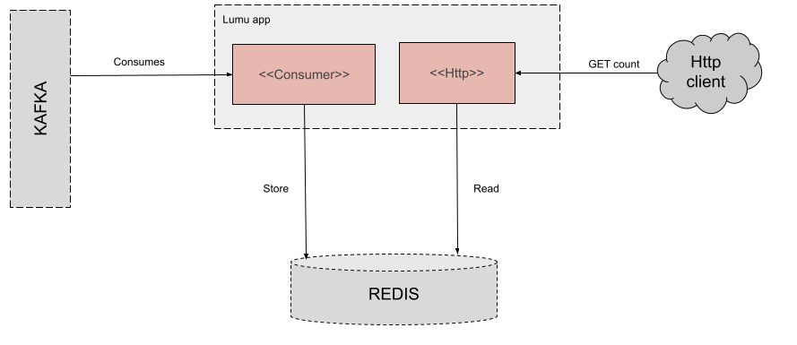

# Lumu App

## Architecture overview

the application has two main components a kafka consumer implemented using the `fs2.Kafka` library and a rest api using the `http4s` library, the motivation for using them is because both are supported in Scala's typelevel ecosystem.

It is intended to use a hexagonal architecture using as base the final Taggless pattern, which will allow us to make an abstraction on the effects throughout the program, which is defined as `F[_]` This taking into account that several assumptions were made at the time of implementation, as the result of the count is required as fast as possible, in case of requiring any adjustment even if it involves a change in the technology of the database this will be agnostic in the implementation of the components that interact with it.

## Technical debt

- [ ] Testing suites
- [ ] Deployment files 

